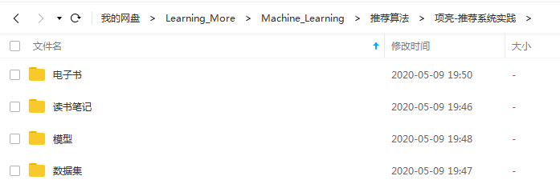

# 《推荐系统实践》读书笔记
&emsp;&emsp;项亮的《推荐系统实践》是推荐系统领域的经典入门教材之一。  
&emsp;&emsp;本书系统阐述了和推荐系统有关的理论基础，介绍了评价推荐系统优劣的各种标准（比如覆盖率、满意度）和方法（比如AB测试），总结了当今互联网领域中各种和推荐有关的产品和服务，并给出了设计和实现推荐系统的方法与技巧，解答了在真实场景中应用推荐技术时最常遇到的一些问题。  

## 使用说明
1. 本笔记是搭配《推荐系统实践》一书来阅读。
2. 本笔记将书中大部分的代码都实现了一遍，包括很多书中的数据可视化的图。  
3. 相关资料下载地址：  
- 链接：https://pan.baidu.com/s/1tQ5FhAo1gdtFp-JhGX_7Ww 
- 提取码：pqf4 
 

**注：**
1. 在pycharm下，需要将src目录设置成Sources Root，因为很多程序都需要读取数据文件，为方便小伙伴们不同的项目路径，采用统一的Sources Root路径。
2. 第2章的程序需要消耗很大的内存，如果不耐烦的小伙伴，可以将模型文件夹下的文件拷贝到src/main/chapter2/store目录下。

## 在线阅读地址
在线阅读地址：https://relph1119.github.io/recommendation-system-practice-notes

## 选用的《推荐系统实践》版本

> 书名：推荐系统实践 
> 作者：项亮 
> 出版社：人民邮电出版社 
> 版次：2012年6月第1版 

## 项目结构
<pre>
docs---------------------------------------在线读书笔记
notes--------------------------------------JupyterNotebook格式读书笔记
src----------------------------------------项目代码
+---data-----------------------------------数据集
+---main-----------------------------------算法代码
+---test-----------------------------------测试用例代码
</pre>
## 主要贡献者（按首字母排名）
 [@胡锐锋-天国之影-Relph](https://github.com/Relph1119)

## 打包下载
阅读笔记PDF下载地址：https://share.weiyun.com/5vgb0wm

## 参考资料
[1] https://github.com/qcymkxyc/RecSys  
[2] https://github.com/Magic-Bubble/RecommendSystemPractice

## LICENSE
[GNU General Public License v3.0](https://github.com/relph1119/recommendation-system-practice-notes/blob/master/LICENSE)